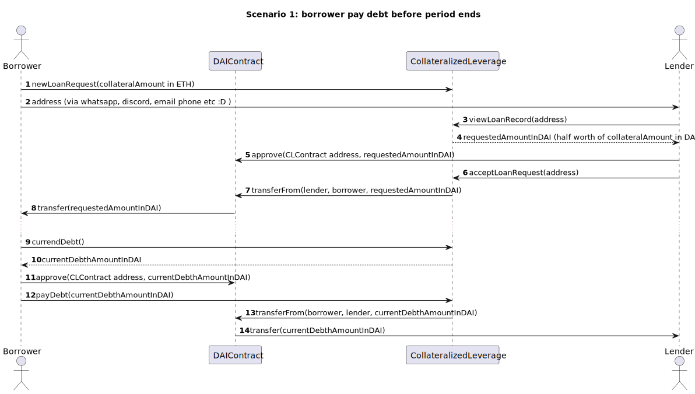
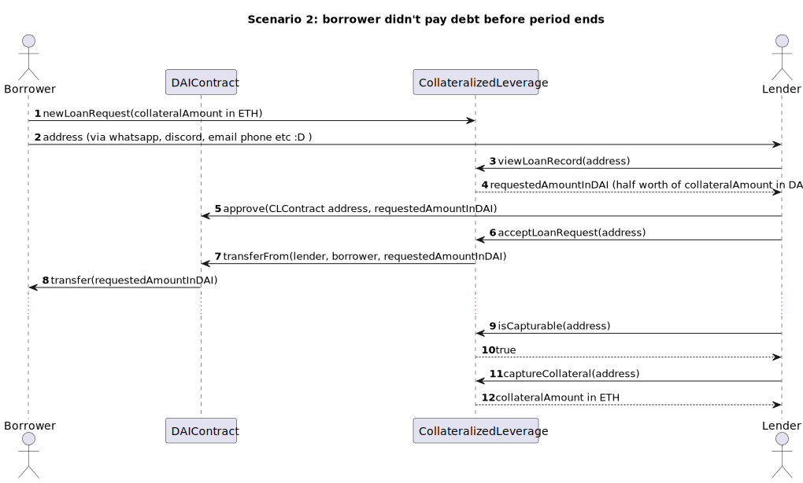
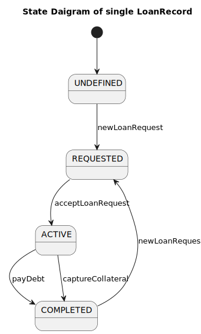
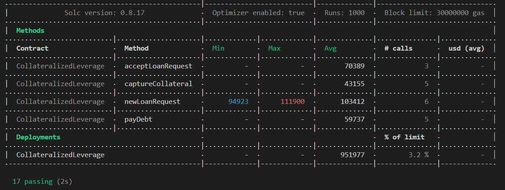
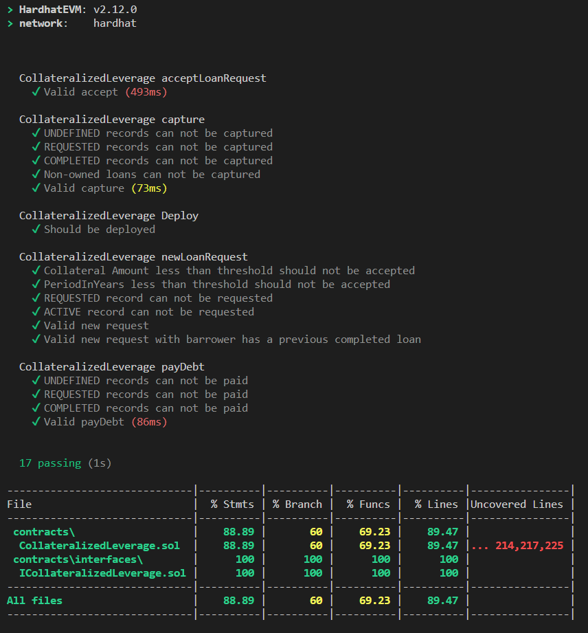

# Collateralized Leverage

## Flow

- Borrower can deposits x amount of token A and lock them for a certain period
- Borrower receives 50% of value of token A into token X

tokenA = WETH in GOERLI

tokenX = DAI in GOERLI

## Scenario 1

Borrower can pay back the loan

- At any time before the expiration the borrower send back amount of token x borrowed plus interests until lock period (10% per month)
- The collateral (token A) is released to him/her
- Happy path

## Scenario 2

Scenario 2 Borrower can’t pay back the loan

- Borrower doesn’t payback within the deadline
- Lender can decide to take collateral at any time
- Borrower can decide to pay back at “at the time” interest (so 5% over a longer period => lock until period + time of repayment) and unleash the collateral

## State Diagram of Single LoanRecord

## Gas Usage Report

## Unit Test Coverage Report

## How to run tests

- Clone the repository
- inside the repository, run `npm i`
- rename .env.sample to .env
- fill the constants in .env file
  - ALCHEMY_API_KEY => needed for forking Goerli
  - GOERLI_WALLET_TO_IMPERSONATE => wallet address in Goerli which has some DAI, needed to impersonate
- run `npx hardhat test`

## Constants

Following hardcoded constants are set for simple demonstration.

- DAI_ETH_MULTIPLIER: 1294
- MONTHLY_INTEREST_RATE: 10
- MONTHLY_DELAYED_INTEREST_RATE: 5
- DAI_TOKEN: DAI token in Goerli

## Notes

- Warning: Owner of the contract is able to withdraw all balance including collateralized ethers.
- Lender should approve DAI transfer in DAI contract before accepting a loan request. Normally this should be in the frontend of this app. But it's not exist yet. This is same for borrower. Borrower should approve DAI transfer in DAI contract before calling payDebt method.
- If loanRequest is not accepted by anyone, there is no mechanism to take back the collateralized ether. It's taken by contract :D
- Borrower and Lender knows each other. Better, async pool implementation where borrowers and lenders don't know each other will be implemented later.
- ViewLoanRecord is added but it's useless. In a real pool version, ViewLoanRecords should be implemented effectively.
